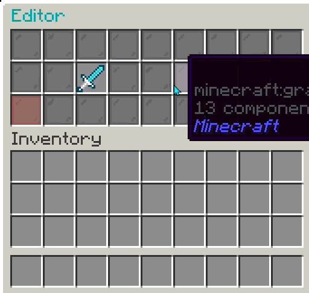
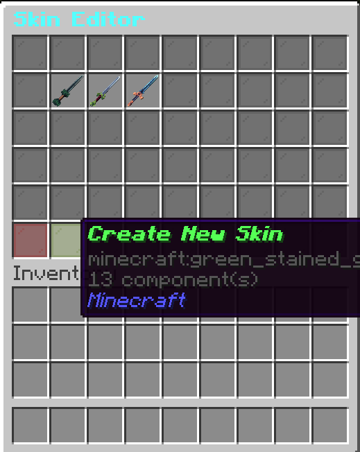
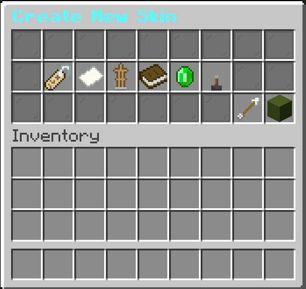
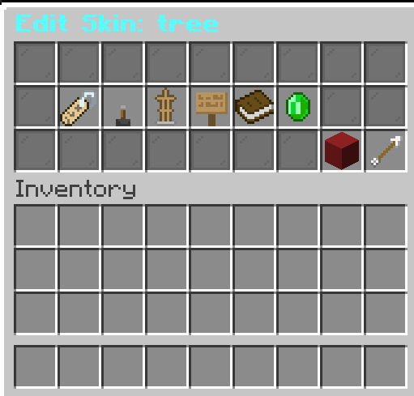
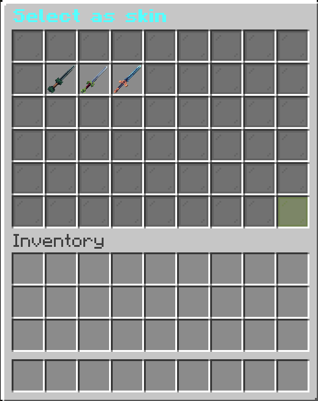

Our plugin comes with a built-in editor, that you can edit skins and bundles with. To access it do `/skinsadmin editor`,
or use the editor item in the admin GUI (Accessed by `/skinadmin`). When you do that, you are presented with 2 options:

- Skin Editor
- Bundle Editor

# The Skin Editor

When you open the skin editor, you'll all the already existing skins and two buttons at the bottom, one to go back, and
one to create a new skin.

## Creating a new skin

Click "Create New Skin", if you haven't already. The editor will look like this:

You can add the following things:

- Skin ID
- Skin Name
- Model ID
- Categories
- Rarity (If enabled)
- Enabled Status

## Editing an existing skin

Click the skin you want to edit. Let's say we want to edit a skin called tree. It will look like this:

This shares a lot of things with creating a new skin. You can edit these things:

- Skin Name
- Enabled Status
- Model ID
- ID
- Categories
- Rarity (If Enabled)

But you can see a big red button, so what can it be? That's the skin deletion dialog. Let's see it in action

## Explanations for skin settings

### Skin ID

The Skin ID is used for internal actions, where the skin object can't be passed. We recommend you not changing this (
Especially manually through the config). The recommended name format is the _Skin Name_ in lowercase and replace spaces
with "_"

### Skin Name

The Skin Name, is the name of the skin used to display the item in the GUIs. It supports Mini Message formatting.

### The Model ID

The model id is the identifier of the "Item Model". The default namespace is "chamoitemskins", but you can change it by
adding your own in the start like: "yournamespace:yourmodel". You can put the namespace as "nexo:", to make the plugin use a nexo item

### The Categories

**Explained in [Core Concepts](/docs/chamoitemskins/administration/introduction/understanding#skins)**

### Rarities

_Please skip this part, if you have disabled rarities_

**Explained in [Core Concepts](/docs/chamoitemskins/administration/introduction/understanding#rarities)**

### Enabled Status

When disabled, players won't be able to see nor apply the skin and can only be seen by admins

# The Bundle Editor

The bundle editor is very similiar to the skin editor. You can create new skins and edit existing ones.

The difference is how you select which skins the bundle contains.

## Selecting skins

Once you're in the Bundle you want to edit/create a new bundle, click "Skins". This will bring you to this GUI:

You can click which skins you want to select, and will prefix their names with "[Selected]". Once you're done click the
Green Stained Glass Pain in the bottom right to confirm it. It will bring you back to the editor.

## Explaining the bundle options

### Name

The display name for the bundle used in the "Notes". Supports Mini Message

### Bundle ID

Used for internal actions where the Bundle object can't be passed. The recommended name format is the _Bundle Name_ in
lowercase and replace spaces
with "_"

### Skins

Skins, are the list of Skins that the bundle contains.